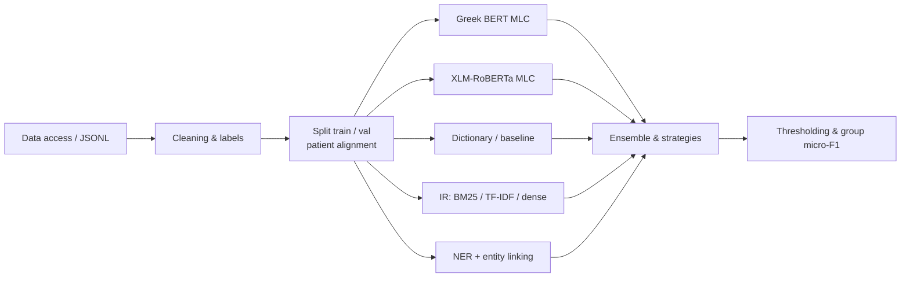
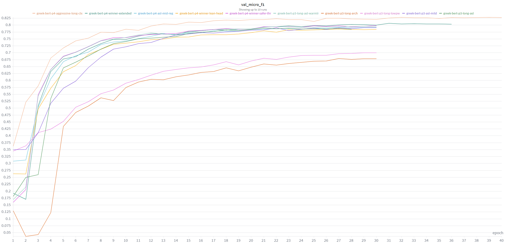
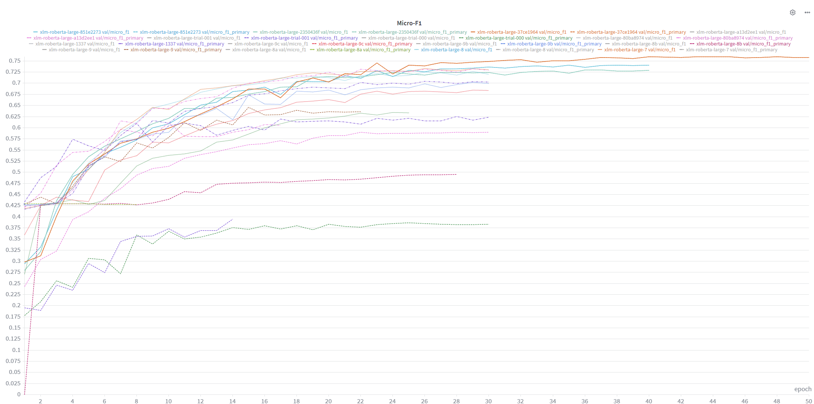

<p align="center">
  
</p>

<h1 align="center">ELCardioCC</h1>

Project within the framework of the **BioASQ / CLEF (ELCardioCC)** shared task from the **AIDA** — *AI and Data Analytics* — postgraduate program of the  [**University of Macedonia**](https://www.uom.gr).

---
 
## The problem

Given a Greek discharge summary from a cardiology clinic, the goal is to predict the relevant ICD-10 codes for each document. This is a multi-label classification task: a document may have multiple correct labels. The labels are grouped into clinical entities (lists of synonymous codes); the organizers’ evaluation is mainly based on Micro-F1 with relaxed matching within each group.

---

## System pipeline

The following pipeline summarizes the path from raw data to the ensemble and final evaluation.



---

## Technologies and what has been implemented

- **Language:** Python 3.10+.
- **Data:** JSONL for records; cleaning and label extraction (`labels_flat`, `document_level_annotations`); **multi-label stratified split** (train/validation) with alignment of **the same patients** (`patient_id`) across cleaned and raw texts.
- **Baseline (dictionary):** term–code mapping from CSV, rules, and fuzzy matching (e.g., FuzzyWuzzy / Levenshtein).
- **Deep learning for MLC (Greek BERT):** **Hugging Face Transformers** and **PyTorch** with `nlpaueb/bert-base-greek-uncased-v1`; **lean MLP** multi-label head (hidden 384, mean pooling) with **ASYMMETRIC LOSS (ASL)**, early stopping, mixed precision (FP16); **threshold tuning** (global sweep + per-class) with `passes: 2` validation.
- **Deep learning for MLC (XLM-RoBERTa):** **XLM-RoBERTa** (base & large) with multi-label head, BCE with class weights, optionally focal/ZLPR loss; for long texts **sliding window** (or chunks) and merging logits per document; **K-fold** for the base track where defined in the corresponding configs.
- **Information retrieval:** code retrieval via **BM25**, **TF-IDF**, **dense embeddings** (sentence-transformers), and **hybrid** combination strategies (e.g., RRF).
- **NER & entity linking:** pipeline combining dictionaries/ontology with the text, producing predictions in submission format.
- **Evaluation:** implementation of official metrics (micro precision/recall/F1); **threshold tuning** (global and per class) based on validation scores.
- **Experiments:** logging with **Weights & Biases** where enabled in configs.

### Indicative Micro-F1 curves (validation, W&B)

Curves **only** for the **Micro-F1** metric across multiple runs.

**Greek BERT** — `val_micro_f1`.



**XLM-RoBERTa large** — `val/micro_f1`.



To install dependencies:

```bash
pip install -r requirements.txt
```
Configuration and execution per subsystem:

- `src/mlc_greek_bert/mlc_greek_bert.yaml`
- `src/xlm_r_large/xlm_r.yaml`
- `src/evaluation/config.yaml`

Additional YAML files are located alongside the respective packages under `src/`.
