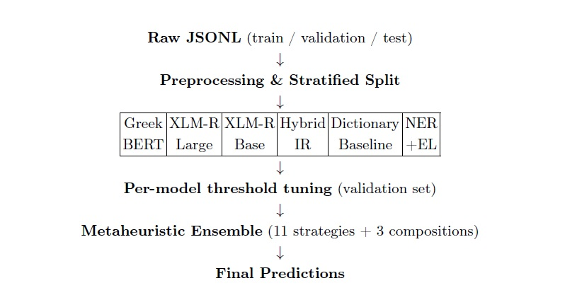
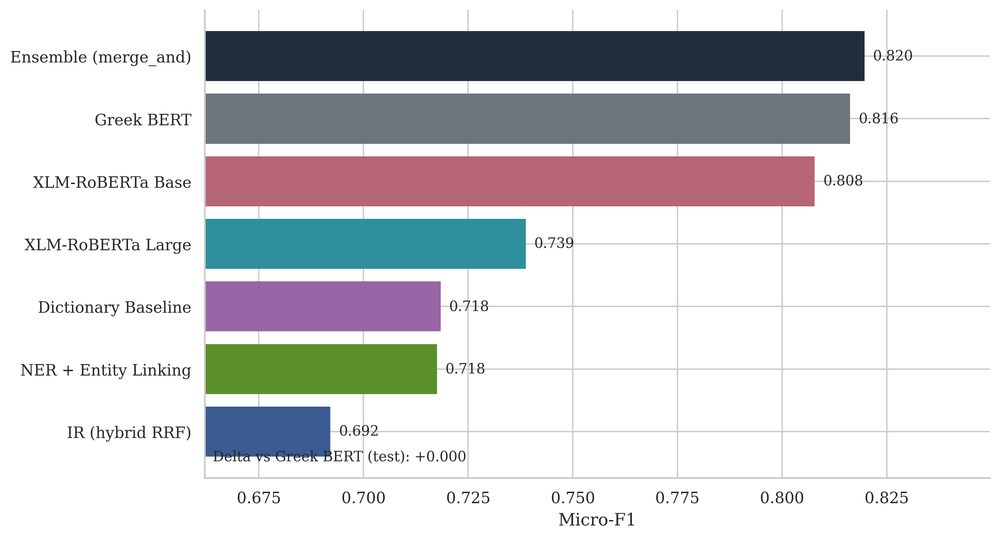
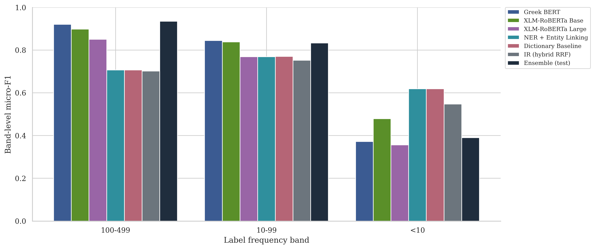
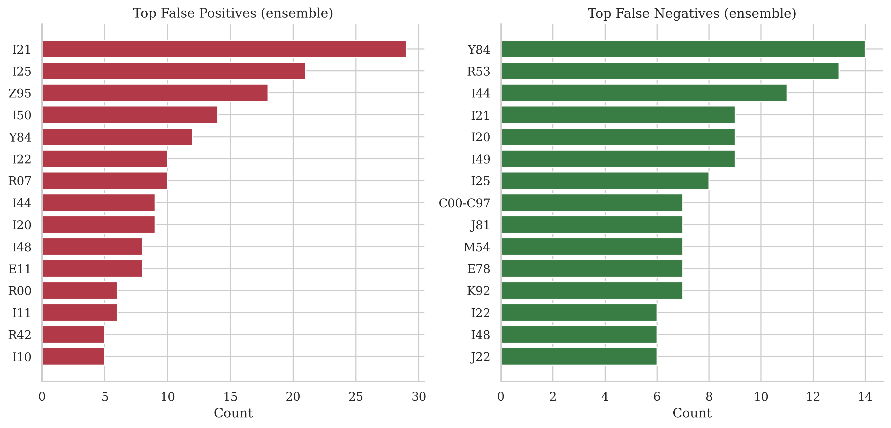
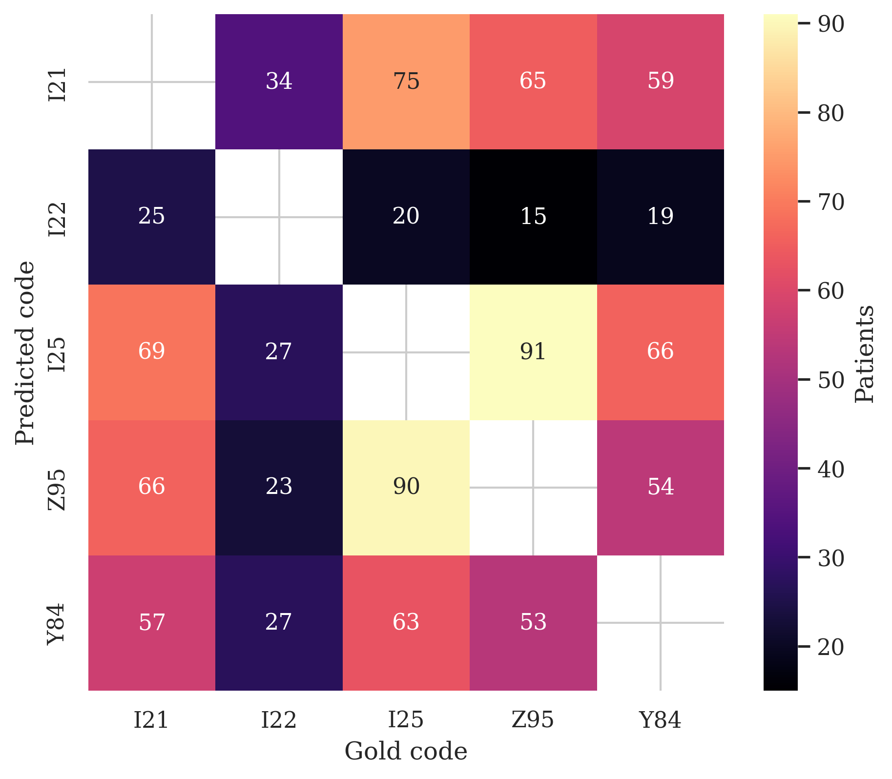

# ELCardioCC

Project within the framework of the **BioASQ / CLEF (ELCardioCC)** shared task from the **AIDA** — *AI and Data Analytics* — postgraduate program of the  **[University of Macedonia](https://www.uom.gr)**.

**First Place Winner** in the BioASQ ELCardioCC 2026 competition with a micro-F1 score of **0.8667** on the official test set!

---

## The problem

Given a Greek discharge summary from a cardiology clinic, the goal is to predict the relevant ICD-10 codes for each document. This is a multi-label classification task: a document may have multiple correct labels. The labels are grouped into clinical entities (lists of synonymous codes); the organizers’ evaluation is mainly based on group-level Micro-F1 with relaxed matching within each group.

Our system successfully tackles challenges such as the Greek morphological richness, code-switching with Latin abbreviations, long documents, and extreme label imbalance across 115 target codes.

---

## System pipeline

Our approach combines six components fused under a metaheuristic ensemble framework, improving by approximately 1.8 F1 points over the best standalone model.




---

## Technologies and Methodology

- **Language:** Python 3.10+.
- **Data:** JSONL for records; **multi-label stratified split** (train/validation) ensuring every validation/test label appears in training.
- **Deep learning for MLC (Greek BERT):** `nlpaueb/bert-base-greek-uncased-v1` with a two-layer MLP head; **ASYMMETRIC LOSS (ASL)** to handle label imbalance; layer-wise learning rate decay; **threshold tuning** (global sweep + per-class).
- **Deep learning for MLC (XLM-RoBERTa):** Base & Large variants to handle Greek-Latin code-switching. Uses sliding windows for long texts, multi-sample dropout, and semantic anchoring with ICD-10 descriptions.
- **Information retrieval:** Code retrieval fused by Reciprocal Rank Fusion (RRF) from **BM25**, **TF-IDF**, and **dense embeddings** (MiniLM).
- **NER & entity linking:** BIO sequence tagger (Greek BERT) with a Partial CRF, augmented by Aho-Corasick dictionary matching.
- **Baseline (dictionary):** Aho-Corasick automaton with cardiology procedure rules and co-occurrence rules.
- **Ensemble:** Declarative metaheuristic search evaluating 11 base strategies (e.g. weighted ensemble, majority vote) and 3 composition operators. Optimized using random restarts, hill-climbing, and Variable Neighbourhood Search (VNS) for the non-differentiable F1 objective.

## Key Results & Figures

Our models address varying code frequencies through distinct components. Greek BERT and XLM-RoBERTa perform strongly overall, while the ensemble optimally balances precision and recall.

**Standalone Micro-F1 per Component**  


**Performance by Label Frequency Band**  
All models degrade on rare labels (<10 instances), reflecting the long-tailed distribution challenge.  


**Top False Positives and False Negatives**  
The ensemble's primary errors stem from frequent but complex temporal assignments (like acute MI vs. subsequent MI) or highly ubiquitous interventions (like Z95 for vascular implants).  


**Acute MI Codes Confusion Cluster**  
Co-prediction counts reveal the challenge in distinguishing temporally related conditions.  


---

To install dependencies:

```bash
pip install -r requirements.txt
```

Configuration and execution per subsystem:

- `src/mlc_greek_bert/mlc_greek_bert.yaml`
- `src/xlm_r_large/xlm_r.yaml`
- `src/evaluation/config.yaml`

Additional YAML files are located alongside the respective packages under `src/`.