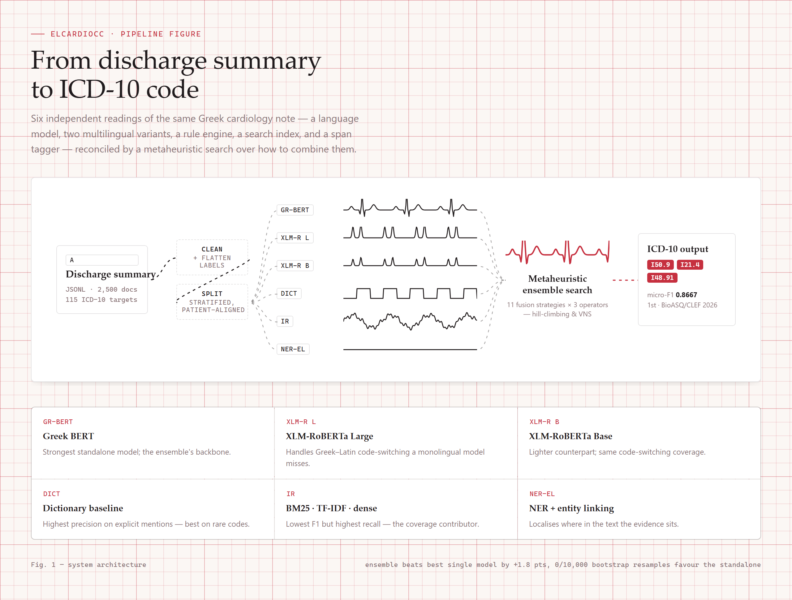

<h1 align="center">ELCardioCC</h1>

<p align="center">
  <b>Automatic ICD-10 coding of Greek cardiology discharge summaries.</b><br>
  <b>1st place</b> at BioASQ / CLEF ELCardioCC 2026 — micro-F1 <b>0.8667</b> on the official test set.
</p>

<p align="center">
  
</p>

A cardiologist writes a discharge summary in free-text Greek. Someone then has to read it and
assign the right ICD-10 codes — for the hospital record, for reimbursement, for national health
statistics. It is slow, it is done by hand, and it is easy to miss a diagnosis buried in the
third paragraph.

**ELCardioCC reads the summary and proposes the codes.** Above: the note is digitised, the system
marks the spans it is reacting to, and each one resolves into an ICD-10 code with a confidence
score. The document in the animation is a synthetic example — no real patient text appears
anywhere in this repository (see [DATA.md](data/DATA.md)).

> Built for the [BioASQ / CLEF ELCardioCC 2026](http://bioasq.org/) shared task as part of the
> **AIDA** (AI and Data Analytics) postgraduate programme at the
> [University of Macedonia](https://www.uom.gr).

---

## The task

Given a Greek discharge summary from a cardiology clinic, predict every relevant ICD-10 code.
This is **multi-label** classification over **115 target codes** across 2,500 documents, and it
is hard for reasons specific to this domain:

| Challenge | Why it hurts |
|---|---|
| Greek morphological richness | The same concept surfaces in many inflected forms |
| Code-switching | Latin abbreviations and drug names sit inside Greek sentences |
| Long documents | Summaries exceed the 512-token window of standard encoders |
| Extreme label imbalance | 30 of the 115 codes appear fewer than 10 times in the entire corpus |

Scoring is **group-level micro-F1**: labels are grouped into clinical entities (sets of
synonymous codes), a gold group is satisfied by any one of its members, and over-predicting
within a group counts as false positives.

---

## Results

Official ELCardioCC 2026 test set:

| Submission | Recall | Precision | **F1** |
|---|:---:|:---:|:---:|
| **ensemble** — `merge_and`: weighted + correction | 0.8510 | 0.8830 | **0.8667** |
| ensemble — `merge_k2`: weighted + per-label + corr. | 0.8687 | 0.8539 | 0.8613 |
| ensemble — safer threshold, `merge_k2` | 0.8767 | 0.8431 | 0.8596 |
| Greek BERT — 100% of the data | 0.8194 | 0.8811 | 0.8491 |
| Greek BERT — 80/10/10 split | 0.8310 | 0.8675 | 0.8489 |

The ensemble beats the best standalone model by **+1.8 points**, and that gap holds up under
testing. A document-level paired bootstrap (10,000 resamples) gives a mean micro-F1 difference of
**+0.0323**, 95% CI `[+0.0212, +0.0437]`, with **zero of 10,000 resamples** favouring the
standalone model. A McNemar test over gold groups recovers **88 groups by the ensemble alone
against 21 by Greek BERT alone** (*p* ≈ 2.6 × 10⁻¹⁰).

Two smaller results worth naming: per-label threshold tuning is worth **+3.7 points** on its own
(0.8062 vs. 0.7693 at a fixed `t = 0.5`), and training Greek BERT on 100% of the data instead of
an 80/10/10 split changes nothing (0.8491 vs. 0.8489) — at this scale the validation split costs
no signal.

---

## How the system works

Six components, deliberately chosen to fail in different places, fused by a search over
ensemble strategies.

<p align="center">
  <picture>
    <source media="(prefers-color-scheme: dark)" srcset="assets/pipeline-diagram-dark.png">
    
  </picture>
</p>

Each component brings a different technique to the same text:

| Component | Approach |
|---|---|
| **Greek BERT** — [`src/mlc_greek_bert/`](src/mlc_greek_bert/) | `nlpaueb/bert-base-greek-uncased-v1` with a 2-layer MLP head, **asymmetric loss** for imbalance, layer-wise LR decay, per-label thresholds |
| **XLM-RoBERTa Large / Base** — [`src/xlm_r_large/`](src/xlm_r_large/) · [`src/xlm_r_base/`](src/xlm_r_base/) | Sliding windows for long documents, multi-sample dropout, semantic anchoring against the ICD-10 Greek descriptions |
| **Dictionary baseline** — [`src/dictionary/`](src/dictionary/) | Aho-Corasick automaton over a mined term→code dictionary, plus cardiology procedure and co-occurrence rules |
| **Information retrieval** — [`src/information_retrieval/`](src/information_retrieval/) | BM25 + TF-IDF + dense MiniLM embeddings, fused by Reciprocal Rank Fusion |
| **NER + entity linking** — [`src/ner_el/`](src/ner_el/) | BIO sequence tagger on Greek BERT with a Partial CRF, augmented by Aho-Corasick matching |
| **Metaheuristic ensemble** — [`src/ensemble_metaheuristic/`](src/ensemble_metaheuristic/) | Declarative search over 11 fusion strategies × 3 composition operators, driven by random restarts, hill-climbing and Variable Neighbourhood Search |

---

## What the errors look like

The headline number hides a split in the label distribution, and this is the most interesting
thing in the project.

**On rare codes, the rule-based components beat every neural model.** Across the 30 codes with
fewer than 10 instances, band-level micro-F1 is roughly **0.62 for the dictionary and NER+EL**
against **0.37 for Greek BERT** and 0.35 for XLM-R Large. On the frequent codes (100–499
instances) the ordering inverts completely — Greek BERT reaches ≈0.92 and the dictionary ≈0.71.
The ensemble, tuned for overall micro-F1, lands at ≈0.39 on the rare band: **it does not recover
the long tail**, it optimises the head. That is the clearest direction for future work.

**Where the codes actually go wrong:**

| Failure mode | Evidence |
|---|---|
| Temporal reasoning | I21 / I22 / I25 (acute MI, subsequent MI, chronic ischaemic disease) co-occur constantly and need reasoning about *when*, which bag-of-token models do not do. I21 is the single largest false-positive source (29). |
| Ubiquitous interventions | Z95 (vascular implants) fires on any stent mention (18 false positives) whether or not the code applies. |
| No lexical surface form | Codes inferred from lab values or implicit multi-sentence evidence — M35, R57 — are never recovered. 31 label types fall entirely outside the dictionary's coverage. |
| Unwritable rare codes | For 10 of the rarest codes there are too few instances for per-label thresholding to apply at all. |

The four analysis figures behind these claims — component F1, frequency bands, top FP/FN, and
the MI confusion cluster — are in [`report/figures/`](report/figures/) and discussed in the
[paper](report/main.pdf).

---

## Computational cost

Measured on a single run per component; useful mostly for the order-of-magnitude gap.

| Component | Backbone params | Training time |
|---|---:|---|
| XLM-RoBERTa Large | 560M | 2h 14m |
| XLM-RoBERTa Base | 278M | 1h 36m |
| Greek BERT (MLC) | 113M | 15m |
| NER + entity linking | 113M | 3m |
| Information retrieval | — | ≈30s (no training; one-off dense encoding) |
| Dictionary baseline | — | ≈5s (no training; rule construction) |

The ensemble search — 10,000 evaluations × 2 restarts × 2 optimisers — runs in **under 5 minutes
on CPU**, because it operates on cached score matrices rather than raw text. Inference over the
250-document validation set is under a minute for every component.

---

## Quickstart

```bash
git clone https://github.com/straf10/aida-elcardiocc-26.git
cd aida-elcardiocc-26
python -m venv .venv && source .venv/bin/activate   # Windows: .venv\Scripts\activate
pip install -r requirements.txt
```

Python 3.10+. The clinical text is **not** in this repo — obtain it from the task organizers and
place it under `data/raw/` as described in [DATA.md](data/DATA.md).

Every subsystem is a module driven by a YAML config, run from the repository root:

```bash
# 1. clean and flatten the raw JSONL
PYTHONPATH=src python -m preprocessing

# 2. multi-label stratified 80/10/10 split
PYTHONPATH=src python -m split_data --config src/split_data/split.yaml

# 3. train a component (each has its own config)
PYTHONPATH=src python -m mlc_greek_bert.train --config src/mlc_greek_bert/mlc_greek_bert.yaml

# 4. run every trained component over the splits
PYTHONPATH=src python -m evaluation.run_predictions

# 5. search for the best fusion of their outputs
PYTHONPATH=src python -m ensemble_metaheuristic
```

<details>
<summary><b>All configuration files</b></summary>

<br>

| Config | Subsystem |
|---|---|
| `src/split_data/split.yaml` | Stratified splitting |
| `src/mlc_greek_bert/mlc_greek_bert.yaml` | Greek BERT (`sweep_config.yaml` for W&B sweeps) |
| `src/xlm_r_large/xlm_r.yaml` | XLM-RoBERTa Large |
| `src/xlm_r_base/xlm_r_base.yaml` | XLM-RoBERTa Base |
| `src/dictionary/dictionary.yaml` | Dictionary baseline |
| `src/ner_el/ner_el.yaml` | NER + entity linking |
| `src/ensemble_metaheuristic/strategy_compositions.yaml` | Ensemble search space |
| `src/evaluation/config.yaml` | Evaluation and prediction runner |

Individual fusion strategies and ablations can be run directly, e.g.
`python -m ensemble_metaheuristic.strategies.weighted_strategy --help` or
`python -m ensemble_metaheuristic.weighted_subset_sweep`.

</details>

---

## Repository layout

```
src/                    one package per component, each with its own YAML config
data/                   labelset, ICD-10 Greek lookup, mined dictionaries, data card (no patient text)
report/                 figures + compiled paper PDF (LaTeX source kept local for now)
assets/                 the pipeline animation
```

Per-component predictions and blind-test submissions (`patient_id` + codes only) are produced
locally by the pipeline but aren't tracked in git — without the non-public dataset they can't be
independently reproduced anyway, so they'd just be repo clutter.

## Data and privacy

The clinical corpus is not redistributable and is not in this repository. What *is* tracked: the
115-code labelset, the ICD-10 Greek description lookup, the mined term→code dictionaries, and split
statistics. Full schema, provenance and split methodology: **[DATA.md](data/DATA.md)**.

## Paper

*A Multi-Component System for Multi-Label ICD-10 Classification of Greek Cardiology Discharge
Summaries* — BioASQ ElCardioCC at CLEF 2026.
Figures under [`report/figures/`](report/figures/); compiled PDF at
[`report/main.pdf`](report/main.pdf). LaTeX source is kept local for now — once the paper appears
in the CEUR Workshop Proceedings, this section will link directly to the published version.

Nikolaos Strafiotis, Panteleimon Stanimeros, Vasiliki Katsara, Georgios Chalkias,
Glykeria Tsavlidou, Stelios Magalios, Effrosyni Nalmpanti, Panteleimon Stamatakis —
University of Macedonia.

## License

[MIT](LICENSE)
