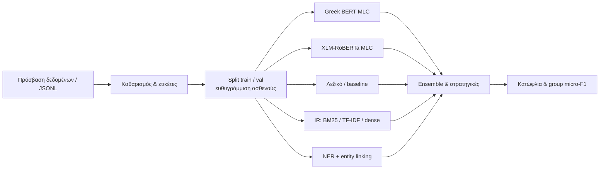

  

<h1 align="center">ELCardioCC</h1>

Έργο στο πλαίσιο του shared task **BioASQ / CLEF (ELCardioCC)** από το μεταπτυχιακό πρόγραμμα **AIDA** — *AI and Data Analytics* — του [**Πανεπιστημίου Μακεδονίας**](https://www.uom.gr).

---

## Το πρόβλημα

Δίνεται **ελληνικό κείμενο εξιτηρίου** από καρδιολογική κλινική· ζητείται να προβλεφθούν οι σχετικοί **κωδικοί ICD-10** για κάθε έγγραφο. Πρόκειται για **πολυ-ετικέτα ταξινόμηση**: ένα έγγραφο μπορεί να έχει πολλές σωστές ετικέτες. Οι ετικέτες ομαδοποιούνται σε **κλινικές οντότητες** (λίστες συνώνυμων κωδικών)· η αξιολόγηση των διοργανωτών βασίζεται κυρίως στο **Micro-F1** με χαλαρή αντιστοίχιση μέσα σε κάθε ομάδα.

---

## Ροή συστήματος (pipeline)

Η ακόλουθη ροή συνοψίζει τη διαδρομή από τα ακατέργαστα δεδομένα μέχρι το ensemble και την τελική αξιολόγηση. Στο **GitHub** το διάγραμμα εμφανίζεται αυτόματα (Mermaid). Σε προβολές χωρίς Mermaid, χρησιμοποιήστε [Mermaid Live Editor](https://mermaid.live) ή εξαγωγή σε SVG/PNG.

---

## Τεχνολογίες και τι έχει υλοποιηθεί

- **Γλώσσα & περιβάλλον:** Python 3.10+, εικονικά περιβάλλοντα, ρυθμίσεις μέσω YAML και `.env` όπου χρειάζεται.
- **Δεδομένα:** JSONL για εγγραφές· καθαρισμός και εξαγωγή ετικετών (`labels_flat`, `document_level_annotations`)· **πολυ-ετικέτα stratified split** (train/validation) με ευθυγράμμιση **ίδιων ασθενών** (`patient_id`) σε καθαρισμένα και raw κείμενα.
- **Βασική γραμμή (λεξικό):** αντιστοίχιση όρων–κωδικών από CSV, κανόνες και fuzzy matching (π.χ. FuzzyWuzzy / Levenshtein).
- **Βαθιά μάθηση για MLC (Greek BERT):** **Hugging Face Transformers** και **PyTorch** με `nlpaueb/bert-base-greek-uncased-v1`· κεφαλή πολυ-ετικέτας **lean MLP** (hidden 384, mean pooling) με **ASYMMETRIC LOSS (ASL)**, early stopping, mixed precision (FP16)· **ρύθμιση κατωφλιού** (global sweep + per-class) με `passes: 2` validation. Ένα ενιαίο config: `src/mlc_greek_bert/mlc_greek_bert.yaml` (artifacts κάτω από `outputs/models/mlc_greek_bert/p4_winner_lean_head/`).
- **Βαθιά μάθηση για MLC (XLM-RoBERTa):** **XLM-RoBERTa** (base & large) με κεφαλή πολυ-ετικέτας, BCE με class weights, προαιρετικά focal/ZLPR loss· για μεγάλα κείμενα **sliding window** (ή chunks) και συγχώνευση logits ανά έγγραφο· **K-fold** για το base track όπου ορίζεται στα αντίστοιχα configs.
- **Information retrieval:** ανάκτηση κωδικών μέσω **BM25**, **TF-IDF**, **dense embeddings** (sentence-transformers) και **υβριδικές** συνδυαστικές στρατηγικές (π.χ. RRF).
- **NER & entity linking:** pipeline που συνδυάζει λεξικά/οντολογία με το κείμενο και παράγει προβλέψεις σε μορφή submission.
- **Αξιολόγηση:** υλοποίηση επίσημων μετρικών (micro precision/recall/F1)· **ρύθμιση κατωφλιών** (global και ανά κλάση) πάνω σε validation scores.
- **Πειράματα:** καταγραφή με **Weights & Biases** όπου είναι ενεργοποιημένο στα configs.

### Ενδεικτικές καμπύλες Micro-F1 (validation, W&B)

Καμπύλες **μόνο** για το κριτήριο **Micro-F1** σε πολλαπλά runs. Τα αρχεία είναι **τοπικά** κάτω από `assets/` (όχι εξωτερικοί σύνδεσμοι) — εμφανίζονται **ενσωματωμένα** στο README όταν ανοίγετε αυτό το αρχείο στο GitHub/Cursor, αρκεί το PNG να βρίσκεται δίπλα στο `README` στο ίδιο branch.

**Greek BERT** — `val_micro_f1` (αντίστοιχα runs, epoch).

**XLM-RoBERTa large** — `val/micro_f1` / primary (αντίστοιχα runs, epoch).

Για εγκατάσταση εξαρτήσεων: `pip install -r requirements.txt`. Ρυθμίσεις και εκτέλεση ανά υποσύστημα: π.χ. `src/mlc_greek_bert/mlc_greek_bert.yaml`, `src/xlm_r_large/xlm_r.yaml`, `src/evaluation/config.yaml`· επιπλέον YAML βρίσκονται δίπλα στα αντίστοιχα packages κάτω από `src/`.
