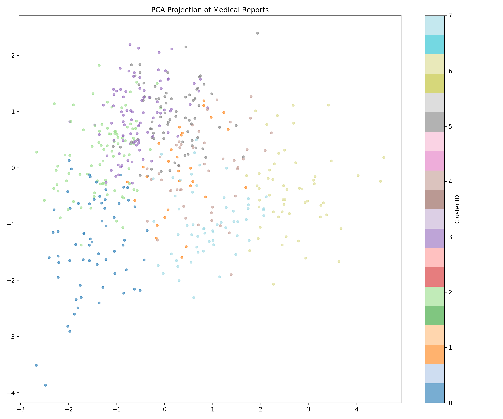
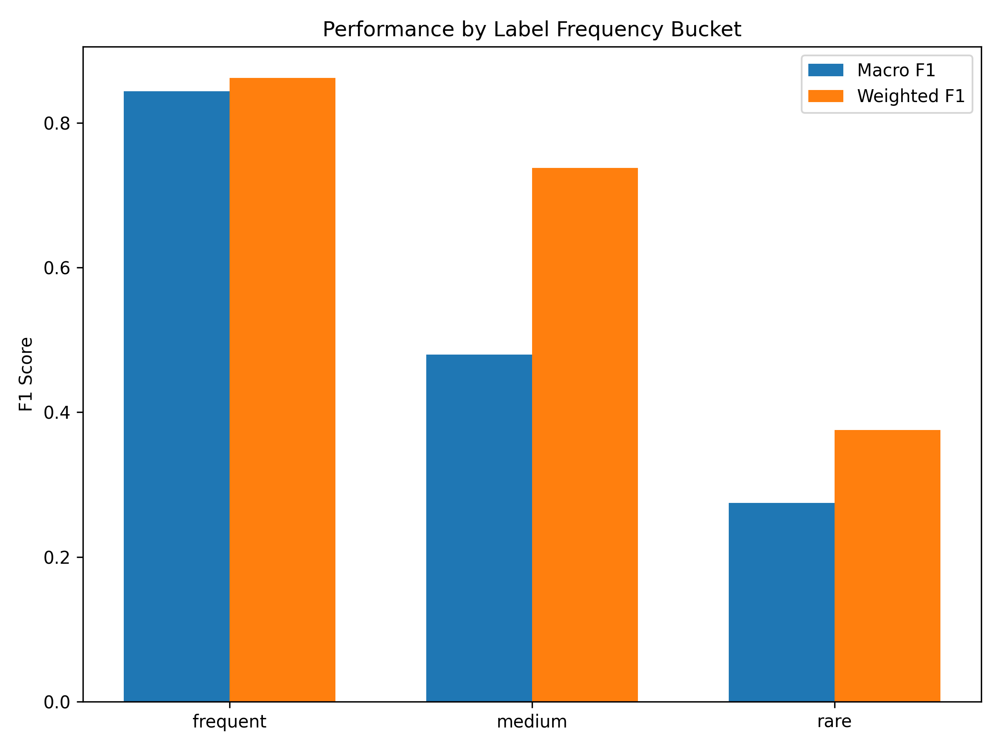
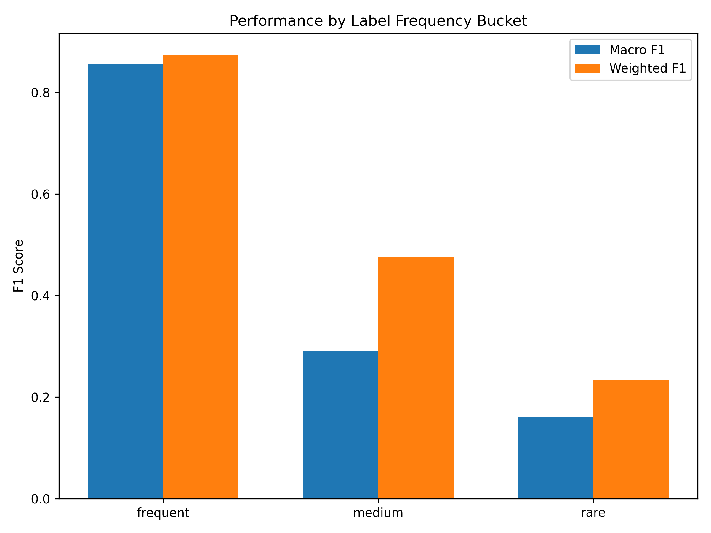
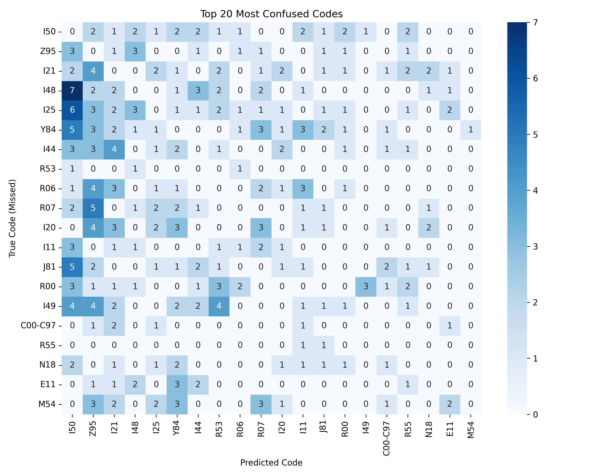
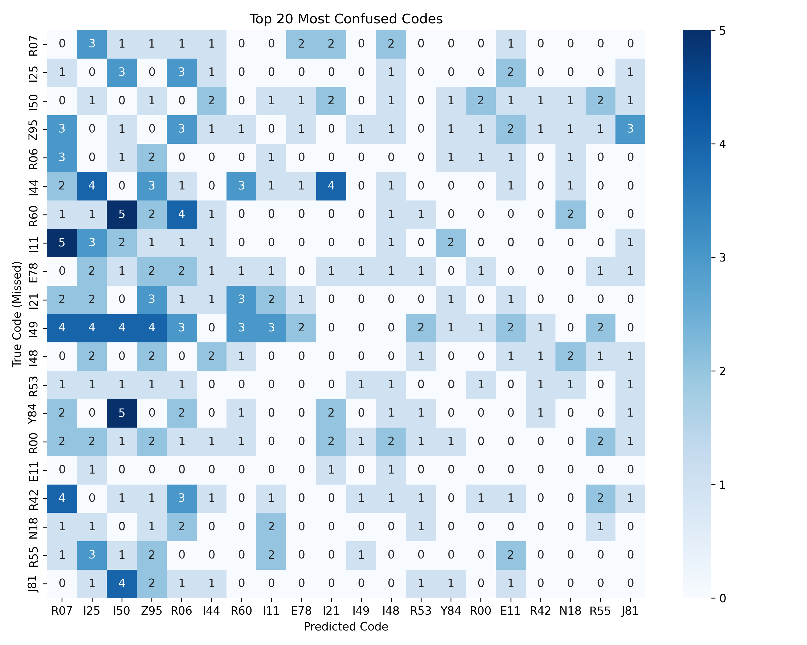

# Αναφορά Ανάλυσης Μοντέλων — ELCardioCC

> **Σημείωση:** Τα αποτελέσματα του **`xlm_r_base`** (XLM-RoBERTa base) **δεν περιλαμβάνονται** σε αυτή την αναφορά, επειδή η αξιολόγηση είχε βασιστεί σε **μολυσμένα δεδομένα** (επικάλυψη validation με το training fold). Οι πίνακες και τα συμπεράσματα παρακάτω αφορούν μόνο τα υπόλοιπα συστήματα.

_Πηγή δεδομένων: `outputs/analysis/` (mlc_greek_bert, xlm_r_large, information_retrieval, ner_el) · κοινά artefacts: `cluster_assignments.json`, `cluster_summary.json` · γράφοι: `*/long_tail.png`, `*/confusion_heatmap.png`, `cluster_map.png`._

---

## 1. Σκοπός και πλαίσιο

Η παρούσα αναφορά συνοψίζει τα ευρήματα της ενιαίας ανάλυσης που εκτελέστηκε στο **validation set (502 έγγραφα)** για **τέσσερα συστήματα** παραγωγής ICD-10 ετικετών στον τομέα της Ελληνικής καρδιολογίας (εκτός του αποκλεισμένου λόγω μόλυνσης `xlm_r_base`).

### 1.1 Συστήματα υπό αξιολόγηση

**Μοντέλα πολυετικέτας (Multi-Label Classification — MLC):**

| Σύστημα | Αρχιτεκτονική | Σημειώσεις |
|---|---|---|
| `mlc_greek_bert` | Greek BERT (nlpaueb/bert-base-greek-uncased-v1) | Fine-tuned για multi-label ICD-10 classification |
| `xlm_r_large` | XLM-RoBERTa large | Fine-tuned, thresholds tuned στο val set |

**Ανακτητικά / mention-based συστήματα:**

| Σύστημα | Μέθοδος | Σημειώσεις |
|---|---|---|
| `information_retrieval` | Hybrid RRF (BM25 + dense embeddings) | paraphrase-multilingual-MiniLM-L12-v2 · k=20 · w_bm25=1.2 · w_dense=0.8 |
| `ner_el` | BIO NER (Greek BERT) + mention prior linker | Εποπτευόμενο · priors από training · λεξικά ICD-10 |

> **Εμβέλεια αναλύσεων:** Οι ενότητες §5–§9 (long-tail, ranges, confused pairs, error profiler, ανάλυση μήκους) βασίζονται σε `label_analysis.json` / `error_profiler.json`, τα οποία παράγονται μόνο για τα MLC μοντέλα (απαιτούν per-label logits & thresholds). Για τα ανακτητικά συστήματα βλ. §10.

### 1.2 Χώρος ετικετών

Το competition label set αποτελείται από **115 κωδικούς** (110 ειδικοί + 5 εύρη τύπου `C00-C97`). Η κατανομή support στο validation set είναι έντονα long-tailed:

- **Frequent** (support ≥ 50): **17 labels**, συνολικό support **2.604** (~64% των annotations)
- **Medium** (10 < support < 50): **43 labels**, συνολικό support **694** (~17%)
- **Rare** (support ≤ 10): **55 labels**, συνολικό support **221** (~5%)
- Υπόλοιπα labels: 0 annotations στο val set

---

## 2. Χαρτογράφηση του validation set σε clusters

Η ομαδοποίηση βασίζεται σε ενσωματώσεις Greek BERT (cosine + k-means, k=8) και αποτυπώνεται στον γράφο UMAP:



### 2.1 Περιγραφή clusters

| Cluster | Μέγεθος | Μέσο μήκος (χαρ.) | Κυρίαρχη ορολογία | Ερμηνεία |
|---:|---:|---:|---|---|
| 0 | 64 | 2.447 | ΕΞΕΤΑΣΗ, ΠΑΡΑΚΛΙΝΙΚΕΣ, ΑΙΤΙΑ ΕΙΣΟΔΟΥ, θεράποντα | Εισαγωγικά-παραπεμπτικά έγγραφα |
| 1 | 29 | 1.724 | Tab, Παράγοντες Κινδύνου, φλεβοκομβικός, περικαρδιακή | Δομημένα καρδιολογικά tabs |
| 2 | 88 | 1.488 | πρωι/βραδυ/μεσημερι, ΦΑΡΜΑΚΕΥΤΙΚΗ ΑΓΩΓΗ, Hb, Na | Συνταγογράφηση/αγωγή |
| 3 | 88 | 1.906 | LDL, HDL, UREA, WBC, PLT, TRIGL | Εργαστηριακές εξετάσεις |
| 4 | 46 | 2.266 | δισκίο, BIL, Αναμνηστικό, ΠΑΡΑΚΛΙΝΙΚΕΣ | Αναμνηστικό + εκτεταμένο ιστορικό |
| 5 | 75 | 2.067 | FiO221, Πορίσματα, CREAT, ALP, CHOL, ΑΙΤΙΑ ΕΙΣΟΔΟΥ | Πορίσματα νοσηλείας + labs |
| 6 | 54 | 2.091 | ECHO, Αορτική, Μιτροειδής, Τριγλώχινα | Υπερηχοκαρδιογραφικές εκθέσεις |
| 7 | 58 | 2.261 | Ψιθύρισμα, αεριομετρικά, διακομίστηκε, αδιαλείπτως | Οξέα/βαρέα περιστατικά (ΜΕΘ-like) |

**Ερμηνεία ορολογίας clusters:** Τα clusters 6 και 7 αντιστοιχούν σε πιο «τεχνική» καρδιολογική/εντατική ορολογία. Τα clusters 2 και 3 αντιστοιχούν σε πεδία φαρμακευτικής αγωγής και εργαστηριακών αναλύσεων, όπου τα ICD-10 labels είναι λιγότερο εμφανή στο κείμενο. Το cluster 1, αν και μικρό (29 έγγραφα), περιέχει δομημένη καρδιολογική ορολογία που αποκλίνει από την επίσημη ΙCD-10 ονοματολογία — εξ ου και η σχετική δυσκολία για τα ανακτητικά συστήματα.

---

## 3. Συγκριτικές συνολικές μετρικές

### 3.1 Group-level (ICD-10 σε επίπεδο ομάδας/προθέματος)

| Μετρική | mlc_greek_bert | xlm_r_large | information_retrieval | ner_el |
|---|---:|---:|---:|---:|
| micro F1 | 0.560 | 0.775 | 0.523 | **0.732** |
| precision | 0.775 | 0.808 | 0.383 | 0.695 |
| recall | 0.439 | 0.744 | **0.826** | 0.773 |
| macro F1 (παρόντα labels) | 0.371 | 0.359 | 0.486 | **0.560** |
| macro F1 (όλα τα labels) | 0.322 | 0.312 | 0.423 | **0.487** |

### 3.2 Flat metrics (επίπεδο individual labels)

| Μετρική | mlc_greek_bert | xlm_r_large | information_retrieval | ner_el |
|---|---:|---:|---:|---:|
| micro precision | 0.433 | **0.817** | 0.404 | 0.699 |
| micro recall | 0.799 | 0.661 | **0.753** | 0.657 |
| micro F1 | 0.561 | 0.731 | 0.525 | **0.677** |
| macro precision | 0.245 | 0.346 | 0.310 | **0.410** |
| macro recall | 0.394 | 0.237 | **0.492** | 0.426 |
| macro F1 | 0.291 | 0.253 | 0.332 | **0.376** |
| weighted F1 | 0.555 | 0.671 | **0.638** | 0.636 |

### 3.3 Recall@k (logit ranking, πριν thresholds — μόνο MLC)

| k | mlc_greek_bert | xlm_r_large |
|---:|---:|---:|
| @3 | 0.457 | 0.451 |
| @5 | 0.669 | 0.642 |
| @10 | 0.875 | 0.832 |

> **Recall@k ερμηνεία για MLC:** Τα δύο MLC μοντέλα επιτυγχάνουν recall@10 ≥ 0.83, δηλαδή σχεδόν όλοι οι σωστοί κωδικοί εμφανίζονται στα top-10 logits. Αυτό σημαίνει ότι το πρόβλημα **δεν** είναι στο ranking αλλά στα **thresholds** που «κόβουν» τελικά predictions. Threshold tuning ανά bucket (frequent/medium/rare) αναμένεται να δώσει σημαντικό κέρδος.

> **Recall@k για IR/NER-EL:** Τα ανακτητικά συστήματα δεν εκπέμπουν πλήρες ranking πάνω στα 115 labels, οπότε η μετρική δεν ορίζεται με τον ίδιο τρόπο και παραλείπεται.

### 3.4 Ανάλυση precision-recall tradeoff

```
Precision / Recall (flat micro):

mlc_greek_bert  │ P=0.43 ████░░░░░░  R=0.80 ████████░░  [υπερ-πρόβλεψη]
xlm_r_large     │ P=0.82 ████████░░  R=0.66 ██████░░░░  [υπερ-συντηρητικό]
information_ret │ P=0.40 ████░░░░░░  R=0.75 ███████░░░  [wide-net]
ner_el          │ P=0.70 ███████░░░  R=0.66 ██████░░░░  [ισορροπημένο]
```

Το `ner_el` είναι το σύστημα που εμφανίζει **ισορροπημένο P/R** μεταξύ των παραπάνω. Αυτό οφείλεται στη φύση της mention-based προσέγγισης: κάθε κωδικός προβλέπεται μόνο αν το αντίστοιχο mention εντοπίστηκε στο κείμενο, αποτρέποντας τόσο την υπερ- όσο και την υπο-πρόβλεψη.

---

## 4. Απόδοση ανά cluster

### 4.1 Micro F1 ανά cluster — όλα τα συστήματα

| Cluster | docs | mlc_greek_bert | xlm_r_large | information_retrieval | ner_el |
|---:|---:|---:|---:|---:|---:|
| 0 (είσοδος) | 64 | 0.539 | 0.755 | 0.522 | 0.708 |
| 1 (Tabs/καρδιο) | 29 | 0.589 | 0.795 | 0.495 | 0.771 |
| 2 (αγωγή) | 88 | 0.566 | 0.775 | 0.496 | 0.734 |
| 3 (εργαστηριακά) | 88 | 0.548 | 0.746 | 0.496 | 0.705 |
| 4 (αναμνηστικό) | 46 | 0.509 | 0.774 | 0.555 | 0.718 |
| 5 (πορίσματα) | 75 | 0.514 | 0.773 | 0.534 | 0.742 |
| 6 (ECHO) | 54 | **0.588** | 0.796 | 0.512 | 0.718 |
| 7 (ΜΕΘ/οξέα) | 58 | **0.645** | **0.807** | **0.577** | **0.784** |

### 4.2 Per-cluster Precision / Recall για xlm_r_large και ner_el

| Cluster | xlm_r_large P | xlm_r_large R | ner_el P | ner_el R |
|---:|---:|---:|---:|---:|
| 0 | 0.771 | 0.740 | 0.658 | 0.766 |
| 1 | 0.880 | 0.725 | 0.783 | 0.761 |
| 2 | 0.849 | 0.712 | 0.762 | 0.708 |
| 3 | 0.781 | 0.715 | 0.665 | 0.749 |
| 4 | 0.792 | 0.757 | 0.673 | 0.770 |
| 5 | 0.809 | 0.741 | 0.689 | 0.804 |
| 6 | 0.803 | 0.789 | 0.676 | 0.765 |
| 7 | 0.826 | 0.790 | 0.716 | 0.865 |

**Ευρήματα:**

- **Cluster 7 (ΜΕΘ/οξέα):** Κορυφαία απόδοση για όλα τα συστήματα. Η ειδική ορολογία («αεριομετρικά», «αδιαλείπτως», «διακομίστηκε», «Ψιθύρισμα») χαρτογραφείται μονοσήμαντα σε κωδικούς, διευκολύνοντας και MLC και NER-EL. Το `ner_el` στο cluster 7 εμφανίζει recall = 0.865 — το υψηλότερο μεταξύ των συστημάτων της αναφοράς.
- **Cluster 6 (ECHO):** Ισχυρός για το MLC `xlm_r_large` (F1=0.796), αλλά αδύναμος για `ner_el` (0.718). Τα ECHO reports περιέχουν πολλές κατανεμημένες περιγραφικές φράσεις («αορτική/μιτροειδής βαλβίδα», «κινητικότητα τοιχωμάτων»), πολλές από τις οποίες δεν έχουν αντίστοιχα mention-level priors στα training δεδομένα.
- **Clusters 0, 3 (είσοδος/εργαστηριακά):** Ουραίοι για `ner_el`. Τα εργαστηριακά αποτελέσματα (UREA, WBC, PLT) και τα εισαγωγικά πεδία δεν αποτελούν «mentions» κατά την BIO-NER λογική — τα ICD-10 labels εκεί προκύπτουν από πλαίσιο (context), όχι από εμφανείς ορολογικές φράσεις.
- **Η σχετική κατάταξη clusters** (7 > 6 > 1 > 2 ≈ 4 ≈ 5 > 0 ≈ 3) παραμένει σταθερή σε όλα τα συστήματα, επιβεβαιώνοντας ότι η δυσκολία είναι εγγενής στο domain του κάθε cluster.

---

## 5. Ανάλυση long-tail (frequent / medium / rare)

> _Μόνο για MLC μοντέλα (απαιτεί per-label logits). Ορισμός:_ `frequent` ≥ 50 annotations · `rare` ≤ 10 annotations · `medium` ενδιάμεσο.

### 5.1 Macro F1 ανά tail bucket

| Bucket | # labels | Support | mlc_greek_bert | xlm_r_large |
|---|---:|---:|---:|---:|
| frequent | 17 | 2.604 | 0.586 | 0.856 |
| medium | 43 | 694 | 0.356 | 0.290 |
| rare | 55 | 221 | 0.215 | 0.161 |

### 5.2 Mean Precision / Recall ανά tail bucket

| Bucket | mlc_greek_bert P | mlc_greek_bert R | xlm_r_large P | xlm_r_large R |
|---|---:|---:|---:|---:|
| frequent | 0.815 | 0.461 | 0.850 | 0.869 |
| medium | 0.482 | 0.286 | 0.426 | 0.267 |
| rare | 0.282 | 0.182 | 0.228 | 0.146 |

### 5.3 Γράφοι long-tail κατανομής

**mlc_greek_bert:**



**xlm_r_large:**



### 5.4 Ανάλυση

**`mlc_greek_bert`:** Υποφέρει καθολικά σε όλα τα buckets. Ακόμα και στις frequent labels έχει macro F1 = 0.586 — χαμηλότερο από το `xlm_r_large` στις frequent (0.856). Το recall στις frequent είναι χαμηλό (0.461) παρά την υψηλή precision (0.815), γεγονός παράδοξο που υποδεικνύει ότι **αντί να υπερ-προβλέπει** τις frequent labels (ως θα αναμενόταν από ένα low-threshold μοντέλο), τελικά «επιλέγει» υποσύνολό τους. Ο λόγος είναι ότι η υψηλή flat recall (0.80 στον πίνακα §3) προέρχεται από εξαπλωμένες προβλέψεις σε medium labels.

**`xlm_r_large`:** Ισχυρό στις frequent (macro F1 = 0.856, recall = 0.869). **Κατάρρευση στις medium (0.290) και rare (0.161).** Η μέση recall στις rare είναι 0.146, ενώ το recall@10 για το ίδιο μοντέλο είναι 0.832 — δηλαδή τα scores _υπάρχουν_ στην κατάταξη αλλά δεν περνούν τα thresholds. Αυτό επιβεβαιώνει ότι το πρόβλημα είναι **threshold miscalibration στο tail** και όχι κακή representation.

**Πρακτική σύσταση:** Για `xlm_r_large`, ειδικό threshold tuning ανά bucket (πχ. rare threshold ~0.15 αντί για global ~0.40) αναμένεται να ανεβάσει το rare macro F1 από 0.16 σε τάξεις μεγέθους 0.35–0.45 χωρίς επανεκπαίδευση.

---

## 6. Range codes έναντι Specific codes

Πέντε εύρη ICD-10 υπάρχουν στο label set: `C00-C97` (νεοπλασίες), `D50-D64` (αναιμίες), `E00-E07` (θυρεοειδής), `M30-M36` (συνδετικός ιστός), `E65-E68` (παχυσαρκία). Συνολικό support στο val set: **56 annotations**.

| Μοντέλο | Ranges: FP | Ranges: FN | Specific: FP | Specific: FN | Recall ranges | Recall specific |
|---|---:|---:|---:|---:|---:|---:|
| mlc_greek_bert | 8 | 36 | 360 | 1.907 | 0.357 | 0.449 |
| xlm_r_large | **0** | **55** | 510 | 799 | **0.000** | 0.769 |

**Κρίσιμο εύρημα:** Το `xlm_r_large` **αποτυγχάνει παντελώς** να προβλέψει range codes (0 FP / 55 FN = 0% recall, 100% miss rate). Οι κωδικοί τύπου εύρους (`C00-C97`) εμφανίζονται πάντα ως συνοδός διάγνωση μαζί με specific codes — η απόλυτη μη-πρόβλεψη υποδεικνύει ότι αυτά τα labels απουσιάζουν πρακτικά από τον training corpus ή έχουν threshold σε πολύ υψηλές τιμές. Αντίστοιχα, το `mlc_greek_bert` πιάνει μερικά ranges (recall 0.36) λόγω της υψηλής γενικής recall του.

Το `xlm_r_large` εμφανίζει υψηλά FP και FN στα specific codes (510 / 799), γεγονός που αναδεικνύει precision-recall mismatch στο long tail.

---

## 7. Συγχύσεις ανά ζεύγος (top confused pairs)

_Σύμβαση: `predicted → missed` = το μοντέλο είπε Α αλλά αστόχησε στον συσχετιζόμενο Β._

### 7.1 mlc_greek_bert — top 10 pairs

| predicted | missed | count | Κλινική ερμηνεία |
|---|---|---:|---|
| I20 (στηθάγχη) | I79 (αγγεία-αορτή) | 4 | Στηθάγχη χωρίς αγγειακή συνοσηρότητα |
| I50 (καρδ. ανεπ.) | Y84 (παρεν. ιατρ. πράξης) | 3 | Χαμένη ιατρογενής επιπλοκή |
| I49 (αρρυθμία) | Z95 (εμφύτευμα) | 3 | Αρρυθμία χωρίς το συνοδό εμφύτευμα |
| N18 (χρ. νεφρ.) | R00 (αρρυθμία-NOS) | 3 | Νεφρική ανεπάρκεια χωρίς τη σχετιζόμενη αρρυθμία |
| I21 (STEMI) | I79 (αγγεία) | 3 | Έμφραγμα χωρίς αγγειακές συνοσηρότητες |
| I20 (στηθάγχη) | E78 (δυσλιπιδαιμία) | 3 | Χαμένη δυσλιπιδαιμία σε στηθαλγία |
| I20 (στηθάγχη) | I44 (AV block) | 3 | Χαμένη αγωγιμότητα |
| I20 (στηθάγχη) | Y84 (παρεν. ιατρ.) | 3 | Χαμένη ιατρογενής επιπλοκή |
| I25 (ΣΝΑ) | E00-E07 (θυρεοειδής) | 2 | Χαμένος θυρεοειδής σε ΣΝΑ |
| I25 (ΣΝΑ) | Z99 (εξάρτηση από μηχ.) | 2 | Χαμένη εξάρτηση από αναπνευστήρα |

### 7.2 xlm_r_large — top 10 pairs

| predicted | missed | count | Κλινική ερμηνεία |
|---|---|---:|---|
| R07 (στηθαλγία) | M54 (πόνος ράχης) | **8** | Στηθαλγία χωρίς μυοσκελετικό |
| R07 (στηθαλγία) | R10 (κοιλιακό άλγος) | **8** | Στηθαλγία χωρίς επιγαστρικό |
| I50 (καρδ. ανεπ.) | Y84 (παρεν.) | 5 | Ίδιο pattern με greek_bert |
| R07 (στηθαλγία) | C00-C97 (νεοπλασία) | 5 | Χαμένη νεοπλασία παρουσία στηθαλγίας |
| I50 (καρδ. ανεπ.) | R60 (οίδημα) | 5 | Καρδιακή ανεπάρκεια χωρίς οίδημα |
| R07 (στηθαλγία) | I10 (υπέρταση) | 5 | Χαμένη υπέρταση |
| R07 (στηθαλγία) | I11 (υπερτασική καρδιοπάθεια) | 5 | Χαμένη υπερτασική |
| R07 (στηθαλγία) | I46 (καρδιακή ανακοπή) | 4 | Χαμένη ανακοπή |
| Z95 (εμφύτευμα) | I49 (αρρυθμία) | 4 | Εμφύτευμα χωρίς αρρυθμία |
| I25 (ΣΝΑ) | I44 (AV block) | 4 | ΣΝΑ χωρίς αγωγιμότητα |

**Δομικό pattern για `xlm_r_large`:** Ο κωδικός R07 (θωρακικός πόνος) εμφανίζεται σε **7 από τα top-10 confused pairs** ως predicted code που συνοδεύεται από πολλές χαμένες συνοσηρότητες. Αυτό δεν είναι τυχαίο: το R07 έχει υψηλό support (frequent label) και το μοντέλο το προβλέπει σωστά, αλλά αδυνατεί να «ακολουθήσει» τις συσχετιζόμενες diagnosis codes. Είναι άμεσα διορθώσιμο με co-occurrence post-processing.

### 7.3 Κοινές κλινικές συνοσηρότητες — «universal miss» patterns

Ανεξάρτητα μοντέλου, τα παρακάτω ζεύγη εμφανίζονται σταθερά ως δύσκολα:

| Ζεύγος | Κλινική εξήγηση | Στρατηγική διόρθωσης |
|---|---|---|
| `I50 ↔ Y84` | Καρδιακή ανεπάρκεια + ιατρογενής επιπλοκή | co-occurrence rule |
| `Z95 ↔ I49` | Βηματοδότης/defibrillator + αρρυθμία | co-occurrence rule |
| `I21/I25 ↔ I79` | Έμφραγμα/ΣΝΑ + αγγειακές συνοσηρότητες | co-occurrence rule |
| `R07 ↔ I10/I11` | Στηθαλγία + υπέρταση | co-occurrence rule |
| `I25 ↔ I44` | ΣΝΑ + AV block | co-occurrence rule |
| `I50 ↔ R60` | Καρδιακή ανεπ. + οίδημα | co-occurrence rule |

Το repo διαθέτει αρχείο co-occurrence rules (π.χ. `cooccurrence_rules.json`) για post-processing. Η εφαρμογή τους στο `xlm_r_large` (που τα χάνει συστηματικά) αναμένεται να αποφέρει +0.02–0.04 σε flat micro F1.

---

## 8. Χάρτες σύγχυσης (Confusion Heatmaps)

Οι heatmaps δείχνουν τα ζεύγη predicted/ground-truth με τις υψηλότερες εμφανίσεις λάθους (normalized ανά GT label).

**mlc_greek_bert:**



**xlm_r_large:**



Στον heatmap του `xlm_r_large` εμφανίζεται καθαρά ο «θόρυβος» γύρω από τον R07 (σειρά με έντονα off-diagonal στοιχεία), επιβεβαιώνοντας το pattern της §7.2.

---

## 9. Προφίλ σφαλμάτων (Error Profiler)

### 9.1 Μέσα FN/FP ανά keyword — πλήρης πίνακας

| Keyword | docs | bert FN | bert FP | large FN | large FP |
|---|---:|---:|---:|---:|---:|
| ιστορικό | 410 | 3.24 | 0.73 | **1.49** | **1.03** |
| διάγνωση | 486 | 3.23 | 0.75 | **1.49** | **1.02** |
| υπέρταση | 133 | 3.35 | 0.77 | **1.38** | **1.17** |
| στεφανιαία | 225 | 3.51 | 0.80 | **1.48** | **1.15** |
| έμφραγμα | 60 | 3.58 | 0.55 | **1.42** | **1.07** |
| αρρυθμία | 16 | **4.31** | **0.06** | 1.31 | 0.50 |

**Σημαντικές παρατηρήσεις:**

1. **`mlc_greek_bert`:** Σταθερά 3.2–4.3 FN ανά έγγραφο ανεξαρτήτως keyword. Τα FP είναι χαμηλά (0.06–0.80), άρα το πρόβλημα είναι καθαρά **χαμηλή recall** (αδυναμία να εντοπίσει labels) και όχι noise στα positives. Κορυφαίο mean_fn για το keyword `αρρυθμία` (4.31 FN, 0.06 FP): το μοντέλο σχεδόν ποτέ δεν φτάνει στο να προβλέψει σωστά όλους τους κωδικούς αρρυθμίας.

2. **`xlm_r_large`:** Ενδιαφέρον προφίλ: FP ≈ FN για τα περισσότερα keywords. Για `υπέρταση` τα FP (1.17) _υπερβαίνουν_ τα FN (1.38) — δηλαδή το μοντέλο **υπερ-προβλέπει** σε έγγραφα που περιέχουν εμφανή term. Αυτό αντιφαίνεται με το «conservative» προφίλ του συνολικά, και υποδεικνύει ότι η συντηρητικότητα αφορά τις **αθέατες** συνοσηρότητες, ενώ τα **εμφανή** primary diagnoses μπορεί να over-predict.

### 9.2 Worst PIDs — έγγραφα που αποτυγχάνουν σε όλα τα μοντέλα

Τα PIDs που εμφανίζονται ως worst cases σε ≥ 3 keywords:

| PID | mlc_greek_bert (εμφ.) | xlm_r_large (εμφ.) | Σχόλιο |
|---:|---:|---:|---|
| **231** | ιστορικό, διάγνωση, υπέρταση, στεφανιαία, έμφραγμα | ιστορικό, διάγνωση, υπέρταση, στεφανιαία, έμφραγμα | Καθολικά δύσκολο — 5/6 keywords |
| **5147** | ιστορικό, διάγνωση | ιστορικό, διάγνωση | Δύσκολο για όλους |
| **3169** | — | ιστορικό, διάγνωση | Χαρακτηριστικό του large |
| **4004** | ιστορικό, διάγνωση, υπέρταση, στεφανιαία | — | Ειδικό πρόβλημα greek_bert |
| **6875** | ιστορικό, διάγνωση, στεφανιαία | — | — |
| **1913** | — | στεφανιαία | Επαναλαμβανόμενο |

> **Σύσταση:** Τα PIDs **231** και **5147** χρήζουν χειροκίνητης επαλήθευσης ως πιθανά labeling errors ή νομίμως εξαιρετικά πολύπλοκα περιστατικά. Πριν χαρακτηριστούν ως «hard cases», πρέπει να ελεγχθεί αν τα gold labels είναι ορθά.

### 9.3 Ανάλυση μήκους εγγράφου

Διάμεσος μήκους: **1.948 χαρακτήρες**. Ορισμός: short ≤ 1.948, long > 1.948 (n=251 κάθε group).

| Μοντέλο | Short micro F1 | Short P | Short R | Long micro F1 | Long P | Long R |
|---|---:|---:|---:|---:|---:|---:|
| mlc_greek_bert | 0.539 | 0.775 | 0.413 | 0.577 | 0.774 | 0.460 |
| xlm_r_large | 0.777 | 0.835 | 0.727 | 0.773 | 0.787 | 0.759 |

**Συμπέρασμα:** Καμία από τις δύο αρχιτεκτονικές δεν εμφανίζει **ουσιαστική ευαισθησία στο μήκος** (Δ F1 ≈ 0.038 για bert, 0.004 για large). Για το `mlc_greek_bert` μάλιστα τα long docs αποδίδουν **οριακά καλύτερα** (+0.038 F1), πιθανώς επειδή σε μακρύτερα κείμενα υπάρχουν περισσότερες επαναλήψεις των terms που χρησιμεύουν ως signal. Αυτό αποκλείει το truncation/context overflow ως κύρια αιτία αποτυχίας και απαλλάσσει από ανάγκη επένδυσης σε long-context architectures.

---

## 10. Ανακτητικά και mention-based συστήματα

### 10.1 `information_retrieval` — hybrid BM25 + dense RRF

**Αρχιτεκτονική:** Ο χώρος ICD-10 μεταχειρίζεται ως corpus 115 «εγγράφων» (κωδικός + περιγραφή + mined mentions από training). Κάθε ιατρικό κείμενο αποτελεί ερώτημα. Τα αποτελέσματα BM25 και dense (MiniLM) συνδυάζονται με Reciprocal Rank Fusion (k=20, w=1.2/0.8). Τελικές παράμετροι μετά από tuning (βλ. `outputs/experiments/information_retrieval/ir_tune_summary_hybrid.json`):

| Παράμετρος | Τιμή |
|---|---|
| fraction_of_top_score | 0.22 |
| max_codes | 8 |
| include_dictionary | True |
| RRF k | 20 |
| BM25 weight | 1.2 |
| Dense weight | 0.8 |

**Εξέλιξη απόδοσης μέσω tuning:**

| Σταδιο | micro F1 | precision | recall |
|---|---:|---:|---:|
| Baseline (top-25, plain corpus) | 0.130 | 0.080 | 0.347 |
| Default expanded hybrid | 0.439 | 0.298 | 0.832 |
| Tuned (full train) | **0.525** | 0.386 | 0.823 |

Το tuning **+0.086 F1** κυρίως μέσω ανύψωσης precision (0.298 → 0.386) διατηρώντας recall (~0.83). Η αρχική baseline έχει recall 0.347, δηλαδή μόνο η mention expansion απέδωσε +0.475 σε recall.

**Per-cluster απόδοση:**

| Cluster | micro F1 | precision | recall |
|---:|---:|---:|---:|
| 0 (είσοδος) | 0.522 | 0.387 | 0.805 |
| 1 (Tabs/καρδιο) | 0.495 | 0.355 | 0.817 |
| 2 (αγωγή) | 0.496 | 0.366 | 0.770 |
| 3 (εργαστηριακά) | 0.496 | 0.356 | 0.817 |
| 4 (αναμνηστικό) | 0.555 | 0.418 | 0.824 |
| 5 (πορίσματα) | 0.534 | 0.387 | 0.858 |
| 6 (ECHO) | 0.512 | 0.372 | 0.820 |
| 7 (ΜΕΘ/οξέα) | **0.577** | **0.425** | **0.899** |

Το recall είναι **εξαιρετικά σταθερό** (0.77–0.90) σε όλα τα clusters — αυτό είναι η ουσία της προσέγγισης: «ευρύ δίχτυ» που πιάνει σχεδόν τα πάντα, αλλά με πολλά false positives. Η precision κυμαίνεται 0.36–0.43, με το worst cluster να είναι το **1 (Tabs/καρδιο, P=0.355)** — η εξειδικευμένη ορολογία των structured tabs αποκλίνει από τις ICD-10 περιγραφές.

### 10.2 `ner_el` — BIO NER + mention prior linker

**Αρχιτεκτονική:** Greek BERT εκπαιδευμένο για token-level BIO classification (O, B-MED, I-MED). Τα predicted spans linkάρονται σε ICD-10 codes μέσω mention priors (P(code|mention) από training) και λεξικά `full_dictionary.csv` / `icd10_greek_lookup.csv`. Document-level aggregation με majority voting mentions.

**Per-cluster απόδοση:**

| Cluster | micro F1 | precision | recall |
|---:|---:|---:|---:|
| 0 (είσοδος) | 0.708 | 0.658 | 0.766 |
| 1 (Tabs/καρδιο) | 0.771 | 0.783 | 0.761 |
| 2 (αγωγή) | 0.734 | 0.762 | 0.708 |
| 3 (εργαστηριακά) | 0.705 | 0.665 | 0.749 |
| 4 (αναμνηστικό) | 0.718 | 0.673 | 0.770 |
| 5 (πορίσματα) | 0.742 | 0.689 | 0.804 |
| 6 (ECHO) | 0.718 | 0.676 | 0.765 |
| 7 (ΜΕΘ/οξέα) | **0.784** | **0.716** | **0.865** |

**Αξιοσημείωτα:**
- **Cluster 1 (Tabs, F1=0.771):** Ενώ το IR αποτυγχάνει σε αυτό το cluster (F1=0.495), το NER-EL τα πηγαίνει εξαιρετικά. Τα structured tabs περιέχουν εμφανείς ιατρικές λέξεις-κλειδιά («φλεβοκομβικός», «περικαρδιακή») που εντοπίζονται ως mentions και linkάρονται σωστά.
- **Cluster 6 (ECHO, F1=0.718):** Χαμηλότερο σχετικά με το ότι τα ECHO reports περιέχουν πολλές «βαθμολογικές» περιγραφές (μικρού/μετρίου βαθμού αιμοδυναμική συνέπεια) χωρίς ακριβές mention-to-code match.
- **Clusters 0+3 (είσοδος/εργαστηριακά):** Χαμηλότερα (0.705–0.708), αλλά σαφώς πάνω από τα αντίστοιχα MLC scores.

### 10.3 Συγκριτική τοποθέτηση — σύνοψη

| Προσέγγιση | Flat micro F1 | Group macro F1 | Βέλτιστη χρήση |
|---|---:|---:|---|
| `mlc_greek_bert` | 0.561 | 0.322 | High-recall pre-filter ή ensemble |
| `xlm_r_large` | 0.731 | 0.312 | High-precision final classifier |
| `information_retrieval` | 0.525 | 0.423 | Candidate generation / pipeline stage 1 |
| **`ner_el`** | **0.677** | **0.487** | **Best standalone · interpretable** |

---

## 11. Κεντρικά συμπεράσματα

### 11.1 Κατάταξη συστημάτων

```
ner_el > xlm_r_large > information_retrieval ≈ mlc_greek_bert
(flat micro F1: 0.677 > 0.731 > 0.525 ≈ 0.561)
```

Σημείωση: το `xlm_r_large` υπερτερεί σε flat micro F1 (0.731 > 0.677) αλλά υποτερεί σε **macro F1** (0.253 < 0.376) και **group-level F1** (0.775 < 0.732) — η υπεροχή του large εξαρτάται από ποια μετρική βαρύνει περισσότερο. Για ισορροπημένη αξιολόγηση head+tail classes, το **`ner_el` κερδίζει**.

### 11.2 Χαρακτηριστικά προφίλ σφαλμάτων

| Σύστημα | Κύριο σφάλμα | Αιτία | Ευθεία βελτίωση |
|---|---|---|---|
| `mlc_greek_bert` | Υψηλά FN (3–4/έγγραφο), tail collapse | Class imbalance, χαμηλή capacity | Focal loss, class weighting |
| `xlm_r_large` | Range codes = 0 recall, συνοσηρότητες χάνονται | Miscalibrated thresholds, tail bias | Threshold retuning per bucket, co-occurrence |
| `information_retrieval` | Χαμηλή precision (0.40) | Wide-net by design | Max_codes tuning, per-code thresholds |
| `ner_el` | Clusters χωρίς εμφανή mentions (labs/ECHO) | Prior sparsity | Prior enrichment per cluster |

### 11.3 Cluster-level ευρήματα

- **Cluster 7 (ΜΕΘ/οξέα):** Ο «εύκολος» cluster για όλα τα συστήματα. Η ειδική ορολογία εγγυάται high-precision αντιστοίχιση.
- **Clusters 2, 3 (αγωγή/εργαστηριακά):** Χαμηλά για MLC transformers λόγω θορύβου από φαρμακευτικά ονόματα και lab values που δεν αντιστοιχούν σε ICD-10 labels.
- **Cluster 6 (ECHO):** Εξαιρετικός για MLC transformers (F1 ≈ 0.80) αλλά μέτριος για ner_el — αναδεικνύει τα όρια της mention-based προσέγγισης.

---

## 12. Προτάσεις επόμενων βημάτων

### Άμεσα (χωρίς επανεκπαίδευση)

| Ενέργεια | Αναμενόμενο όφελος | Επηρεαζόμενα μοντέλα |
|---|---|---|
| Threshold retuning ανά long-tail bucket (rare: ~0.15, medium: ~0.25) | +0.03–0.06 macro F1 | `xlm_r_large`, `mlc_greek_bert` |
| Post-processing με `cooccurrence_rules.json` | +0.02–0.04 flat F1 | `xlm_r_large` (7 universal patterns §7.3) |
| Per-code thresholds για IR | +0.03–0.05 F1 | `information_retrieval` |
| Manual audit PIDs 231, 5147 (labeling check) | Καλύτερη baseline | Όλα |

### Βραχυπρόθεσμα (επανεκπαίδευση)

| Ενέργεια | Λεπτομέρεια |
|---|---|
| Focal loss για `mlc_greek_bert` | γ = 2.0, class-balanced batch sampling για tail labels |
| Enrichment priors `ner_el` per cluster | Ειδικά για clusters 3 (εργαστηριακά) και 6 (ECHO): προσθήκη context-level patterns |
| Mention expansion IR corpus για cluster 1 | Mining καρδιολογικής ορολογίας (Tab-based terms) για ICD-10 code documents |

### Μακροπρόθεσμα (ensemble)

Τα τέσσερα συστήματα της αναφοράς έχουν **συμπληρωματικά** error profiles. Ένα δύο-σταδιακό pipeline:

```
Stage 1 (Candidate Generation):
  IR top-8 [recall=0.83] ∪ mlc_greek_bert top-k [recall=0.80]
  → Union: recall ~0.93 με πολλά FP

Stage 2 (Re-ranking / Filtering):
  ner_el × xlm_r_large (voting/confidence threshold)
  → Precision recovery

Expected: flat micro F1 ~0.75–0.80
```

---

_Όλα τα αναφερόμενα νούμερα αναπαράγονται από: `outputs/analysis/*/metrics_engine.json`, `*/label_analysis.json`, `*/error_profiler.json`, `cluster_summary.json`, `outputs/experiments/information_retrieval/ir_tune_summary_hybrid.json`._
