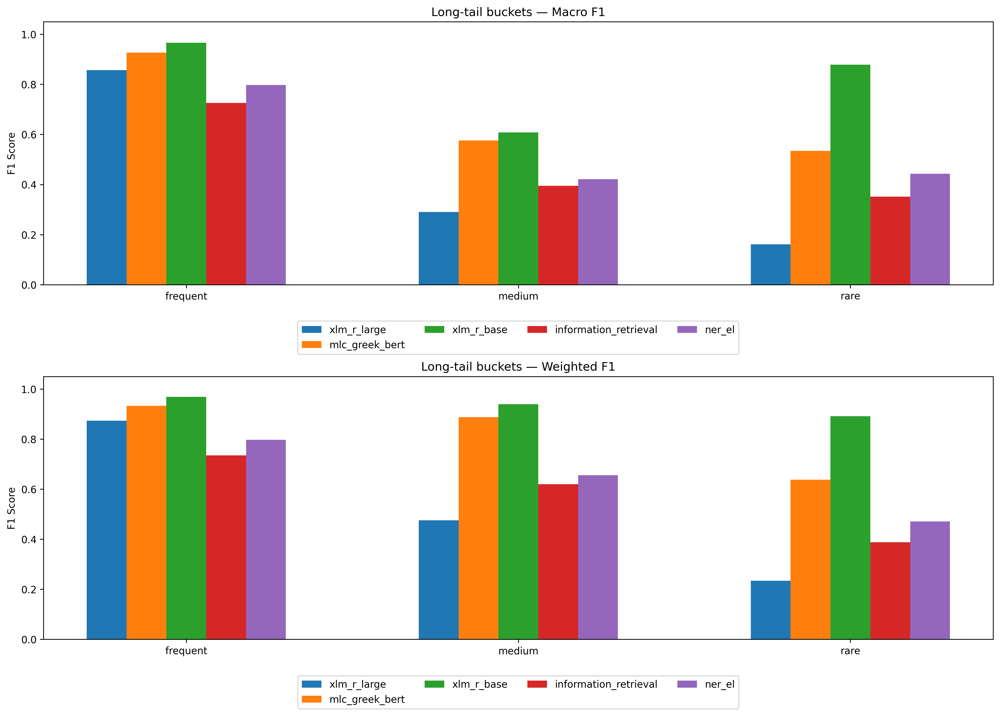
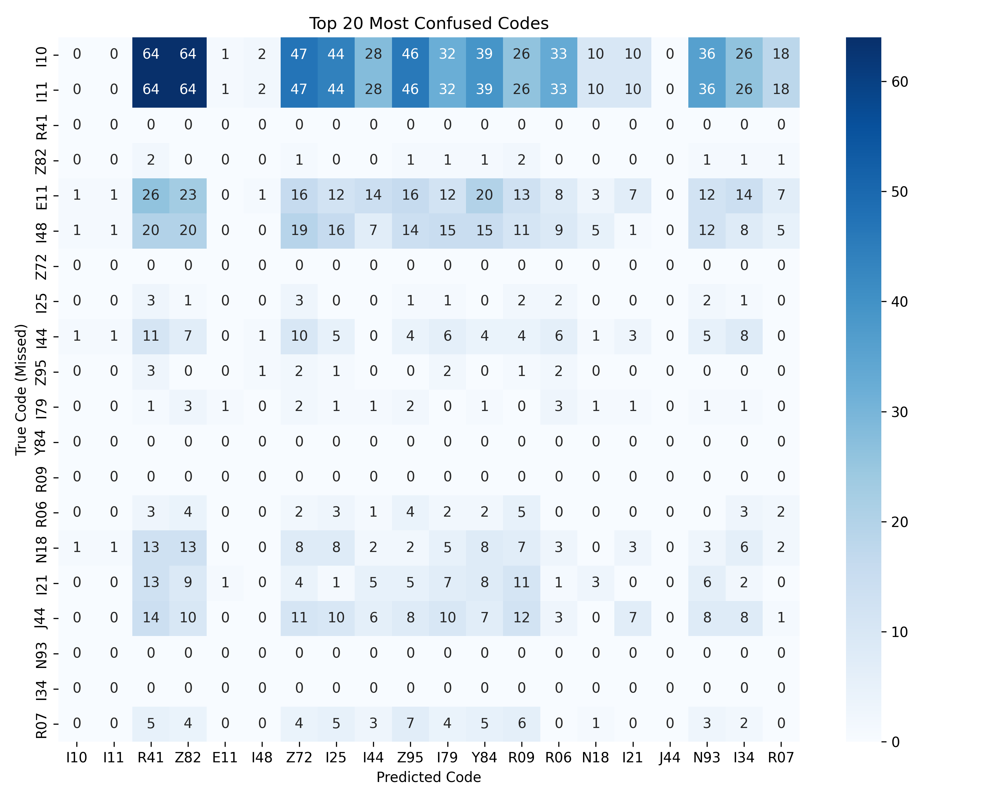
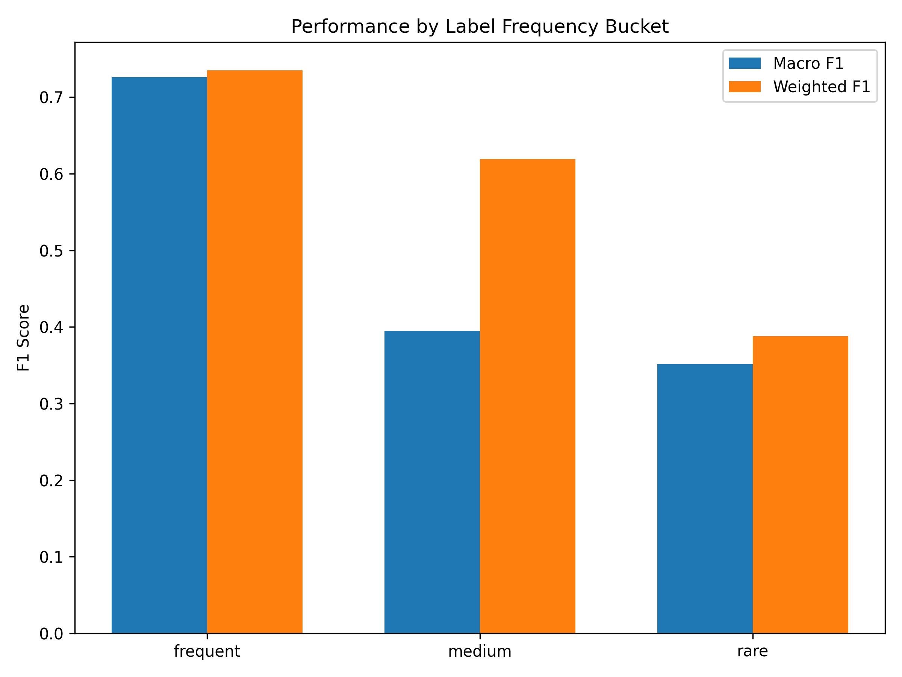
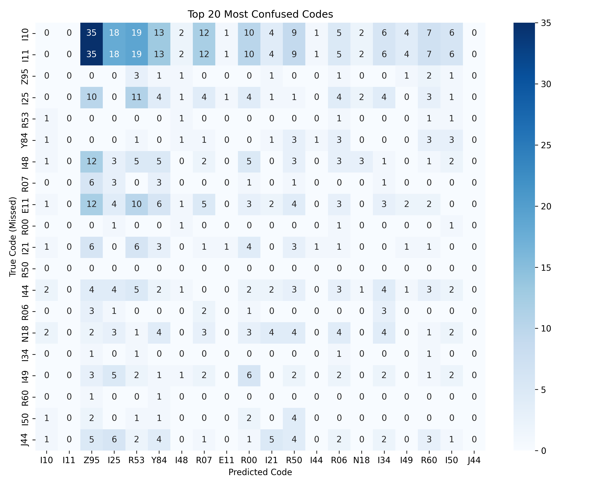
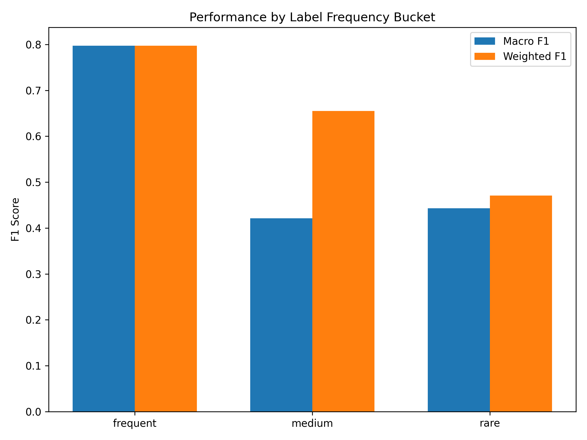
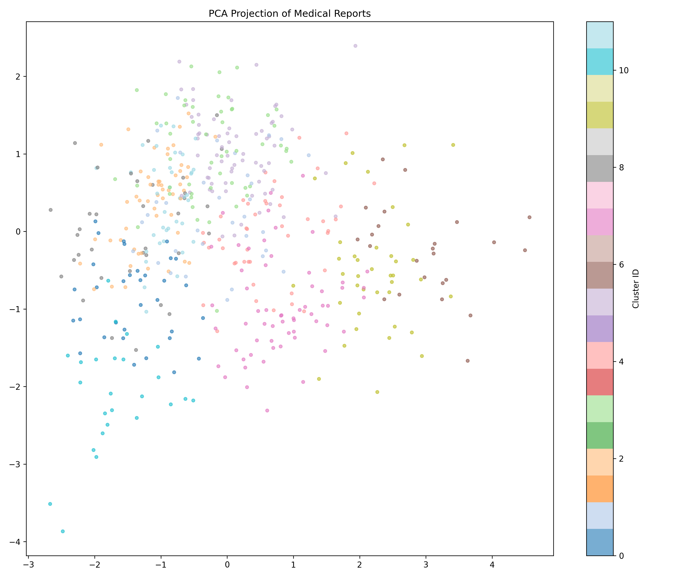

# Medical Report Summary

## 1. Cross-Model Comparison

| Model | Micro-F1 (Group) | Micro-F1 (Flat) | Macro-F1 | Weighted-F1 | Recall@3 | Recall@5 |
|---|---|---|---|---|---|---|
| **xlm_r_large** | 0.7747 | 0.7308 | 0.2534 | 0.6711 | 0.4507 | 0.6417 |
| **mlc_greek_bert** | 0.9013 | 0.8882 | 0.5844 | 0.8778 | 0.4829 | 0.7104 |
| **xlm_r_base** | 0.9505 | 0.9533 | 0.7618 | 0.9524 | 0.5001 | 0.7308 |
| **information_retrieval** | 0.5233 | 0.5255 | 0.3316 | 0.6384 | N/A | N/A |
| **ner_el** | 0.7321 | 0.6774 | 0.3758 | 0.6362 | N/A | N/A |

### Long-tail (frequency bucket) comparison across models

## 2. Per-Model Details

### xlm_r_large

#### Long-Tail Performance

| Bucket | N Labels | Support | Macro F1 | Weighted F1 |
|---|---|---|---|---|
| frequent | 17 | 2604 | 0.8563 | 0.8729 |
| medium | 43 | 694 | 0.2903 | 0.4751 |
| rare | 55 | 221 | 0.1607 | 0.2345 |

#### Top 10 Confused Pairs

| Predicted (Wrong) | Missed (True) | Count |
|---|---|---|
| R07 | M54 | 8 |
| R07 | R10 | 8 |
| I50 | Y84 | 5 |
| R07 | C00-C97 | 5 |
| I50 | R60 | 5 |
| R07 | I10 | 5 |
| R07 | I11 | 5 |
| R07 | I46 | 4 |
| Z95 | I49 | 4 |
| I25 | I44 | 4 |

#### Keyword Hard Cases

| Keyword | N Docs | Mean FP | Mean FN | Worst PIDs |
|---|---|---|---|---|
| ιστορικό | 410 | 1.03 | 1.49 | 3169, 231, 5147, 1089, 1913 |
| διάγνωση | 486 | 1.02 | 1.49 | 3169, 231, 5147, 1089, 1913 |
| υπέρταση | 133 | 1.17 | 1.38 | 231, 7878, 6031, 8438, 9230 |
| στεφανιαία | 225 | 1.15 | 1.48 | 231, 1913, 7599, 2513, 6695 |
| έμφραγμα | 60 | 1.07 | 1.42 | 231, 5516, 9103, 3028, 6888 |
| αρρυθμία | 16 | 0.50 | 1.31 | 5090, 6316, 6839, 5397, 6834 |

#### Short vs Long Reports

Split Threshold: 1948.5 chars

| Split | N Docs | Micro-F1 | Precision | Recall |
|---|---|---|---|---|
| Short | 251 | 0.7773 | 0.8354 | 0.7267 |
| Long | 251 | 0.7727 | 0.7874 | 0.7585 |

---

### mlc_greek_bert

#### Long-Tail Performance

| Bucket | N Labels | Support | Macro F1 | Weighted F1 |
|---|---|---|---|---|
| frequent | 17 | 2604 | 0.9268 | 0.9331 |
| medium | 43 | 694 | 0.5759 | 0.8873 |
| rare | 55 | 221 | 0.5347 | 0.6372 |

#### Top 10 Confused Pairs

| Predicted (Wrong) | Missed (True) | Count |
|---|---|---|
| I50 | Y84 | 3 |
| Z95 | R00 | 3 |
| I21 | I20 | 3 |
| I25 | Z99 | 2 |
| I25 | I44 | 2 |
| Z95 | I44 | 2 |
| I50 | I49 | 2 |
| I50 | I44 | 2 |
| I48 | I49 | 2 |
| R06 | I05 | 2 |

#### Keyword Hard Cases

| Keyword | N Docs | Mean FP | Mean FN | Worst PIDs |
|---|---|---|---|---|
| ιστορικό | 410 | 0.46 | 0.70 | 5644, 9150, 3028, 813, 9103 |
| διάγνωση | 486 | 0.45 | 0.67 | 5644, 3028, 813, 9103, 147 |
| υπέρταση | 133 | 0.43 | 0.67 | 147, 231, 2493, 2814, 1134 |
| στεφανιαία | 225 | 0.51 | 0.72 | 9150, 3028, 9103, 147, 231 |
| έμφραγμα | 60 | 0.43 | 0.85 | 9150, 3028, 9103, 231, 4088 |
| αρρυθμία | 16 | 0.00 | 0.38 | 5662, 9349, 3525, 5090, 306 |

#### Short vs Long Reports

Split Threshold: 1948.5 chars

| Split | N Docs | Micro-F1 | Precision | Recall |
|---|---|---|---|---|
| Short | 251 | 0.9142 | 0.9224 | 0.9061 |
| Long | 251 | 0.8905 | 0.9192 | 0.8635 |

---

### xlm_r_base

#### Long-Tail Performance

| Bucket | N Labels | Support | Macro F1 | Weighted F1 |
|---|---|---|---|---|
| frequent | 17 | 2604 | 0.9660 | 0.9682 |
| medium | 43 | 694 | 0.6076 | 0.9396 |
| rare | 55 | 221 | 0.8789 | 0.8914 |

#### Top 10 Confused Pairs

| Predicted (Wrong) | Missed (True) | Count |
|---|---|---|
| I25 | I26 | 2 |
| Z95 | I26 | 2 |
| Z95 | I44 | 2 |
| I21 | Y84 | 2 |
| I50 | Y84 | 2 |
| R07 | I10 | 2 |
| R07 | I11 | 2 |
| I21 | J81 | 2 |
| I21 | Z95 | 2 |
| I22 | J81 | 2 |

#### Keyword Hard Cases

| Keyword | N Docs | Mean FP | Mean FN | Worst PIDs |
|---|---|---|---|---|
| ιστορικό | 410 | 0.39 | 0.22 | 3169, 5147, 2439, 154, 1134 |
| διάγνωση | 486 | 0.36 | 0.21 | 3169, 5147, 2439, 154, 1134 |
| υπέρταση | 133 | 0.32 | 0.20 | 1134, 147, 878, 1896, 7023 |
| στεφανιαία | 225 | 0.42 | 0.21 | 2439, 1134, 147, 3886, 3972 |
| έμφραγμα | 60 | 0.42 | 0.13 | 6888, 6904, 5774, 9210, 231 |
| αρρυθμία | 16 | 0.25 | 0.00 | 4939, 306, 2090, 2798, 3525 |

#### Short vs Long Reports

Split Threshold: 1948.5 chars

| Split | N Docs | Micro-F1 | Precision | Recall |
|---|---|---|---|---|
| Short | 251 | 0.9511 | 0.9372 | 0.9654 |
| Long | 251 | 0.9500 | 0.9389 | 0.9614 |

---

### information_retrieval

#### Long-Tail Performance

| Bucket | N Labels | Support | Macro F1 | Weighted F1 |
|---|---|---|---|---|
| frequent | 17 | 2604 | 0.7262 | 0.7351 |
| medium | 43 | 694 | 0.3946 | 0.6194 |
| rare | 55 | 221 | 0.3516 | 0.3880 |

#### Top 10 Confused Pairs

| Predicted (Wrong) | Missed (True) | Count |
|---|---|---|
| Z82 | I10 | 64 |
| Z82 | I11 | 64 |
| R41 | I10 | 64 |
| R41 | I11 | 64 |
| Z72 | I10 | 47 |
| Z72 | I11 | 47 |
| Z95 | I10 | 46 |
| Z95 | I11 | 46 |
| I25 | I10 | 44 |
| I25 | I11 | 44 |

#### Keyword Hard Cases

| Keyword | N Docs | Mean FP | Mean FN | Worst PIDs |
|---|---|---|---|---|
| ιστορικό | 410 | 7.58 | 1.06 | 3169, 5147, 2086, 1089, 3709 |
| διάγνωση | 486 | 7.64 | 1.00 | 3169, 5147, 9224, 2086, 1089 |
| υπέρταση | 133 | 8.03 | 0.63 | 5076, 895, 7037, 8299, 231 |
| στεφανιαία | 225 | 7.51 | 0.97 | 9224, 2086, 9358, 511, 5076 |
| έμφραγμα | 60 | 7.32 | 0.83 | 9224, 6904, 7330, 8299, 231 |
| αρρυθμία | 16 | 6.75 | 0.69 | 6316, 4939, 3525, 5662, 2090 |

#### Short vs Long Reports

Split Threshold: 1948.5 chars

| Split | N Docs | Micro-F1 | Precision | Recall |
|---|---|---|---|---|
| Short | 251 | 0.5069 | 0.3690 | 0.8091 |
| Long | 251 | 0.5370 | 0.3948 | 0.8394 |

---

### ner_el

#### Long-Tail Performance

| Bucket | N Labels | Support | Macro F1 | Weighted F1 |
|---|---|---|---|---|
| frequent | 17 | 2604 | 0.7973 | 0.7972 |
| medium | 43 | 694 | 0.4211 | 0.6551 |
| rare | 55 | 221 | 0.4428 | 0.4706 |

#### Top 10 Confused Pairs

| Predicted (Wrong) | Missed (True) | Count |
|---|---|---|
| Z95 | I10 | 35 |
| Z95 | I11 | 35 |
| R53 | I10 | 19 |
| R53 | I11 | 19 |
| I25 | I10 | 18 |
| I25 | I11 | 18 |
| Y84 | I10 | 13 |
| Y84 | I11 | 13 |
| Z95 | I48 | 12 |
| R07 | I10 | 12 |

#### Keyword Hard Cases

| Keyword | N Docs | Mean FP | Mean FN | Worst PIDs |
|---|---|---|---|---|
| ιστορικό | 410 | 1.93 | 1.37 | 3169, 8769, 9122, 2633, 3709 |
| διάγνωση | 486 | 1.96 | 1.31 | 3169, 9224, 8769, 9122, 2633 |
| υπέρταση | 133 | 2.35 | 0.90 | 231, 5076, 8347, 6464, 895 |
| στεφανιαία | 225 | 2.26 | 1.25 | 9224, 9122, 9358, 2086, 231 |
| έμφραγμα | 60 | 2.10 | 1.22 | 9224, 231, 6904, 9103, 3028 |
| αρρυθμία | 16 | 1.56 | 1.00 | 8417, 6316, 3525, 5662, 4939 |

#### Short vs Long Reports

Split Threshold: 1948.5 chars

| Split | N Docs | Micro-F1 | Precision | Recall |
|---|---|---|---|---|
| Short | 251 | 0.7344 | 0.7211 | 0.7483 |
| Long | 251 | 0.7303 | 0.6765 | 0.7933 |

---

## 3. Medical Clusters (Global Validation Set)

| Cluster ID | Size | Mean Len | Top Terms |
|---|---|---|---|
| 0 | 33 | 2405 | ΕΞΕΤΕΤΑΣΗ, ασθενης, ΔΙΑΚΟΠΗ, ΕΠΙΣΥΝΑΠΤΟΝΤΑΙ, ΕΙΣΟΔΟΥ, ΑΙΤΙΑ, ΠΑΡΑΚΛΙΝΙΚΕΣ, θεράποντα, ενδείξεων, HR, Ro, COVID, ΑΨ, Καθημερινη, BP |
| 1 | 33 | 1855 | XX, Tab, XXXX, ΧΧ, αναμνηστικό, Επισυναπτεται, βαλβίδα, Παρούσα, κολπικής, Tabs, μαρμαρυγής, βαλβίδος, επηρεασμένη, Δεξιός, Εργαστηριακά |
| 2 | 53 | 1633 | πρωι, βραδυ, αγωγης, ΕΞΕΤΕΤΑΣΗ, Rο, μεσημερι, οξυ, Εως, ΦAΡΜΑΚΕΥΤΙΚΗ, απο, ασθενης, GLU, καλη, Επιμελης, Φερριτινη |
| 3 | 51 | 1559 | XX, Εισαγωγής, XXXX, απο, λεπτό, φάση, παρούσα, ομαλή, Στην, Tbs, υπήρξε, ασθενης, κοιλιας, Echo, αναμνηστικό |
| 4 | 44 | 2332 | δισκίο, ένα, ΚΕ, ΕΞΕΤΕΤΑΣΗ, BIL, Αναμνηστικό, ΕΞΕΤΑΣΗ, θώρακα, Νοσηλείας, Καρδιολογικό, υπερηχοκαρδιογραφικός, γνωμάτευσης, ΕΙΣΟΔΟΥ, ΑΙΤΙΑ, Εισαγωγής |
| 5 | 68 | 2013 | BIL, ΕΞΕΤΕΤΑΣΗ, Πορίσματα, FiO221, Φαρμ, ΠΑΡΑΚΛΙΝΙΚΕΣ, Dimers, Troponin, Tot, fT4, Prot, HCT, Glucose, Glob, δισκίο |
| 6 | 24 | 2214 | XX, δισκίο, ένα, Εισαγωγής, XXXX, Tbs, αυτής, λειτουργικότητα, εστάλη, επιμελή, λεπτό, Echo, ΚΕ, φυσιολογικές, βαλβίδα |
| 7 | 60 | 2262 | XX, Φυσική, Ψιθύρισμα, κλινικός, Σφ, Παρούσα, συνεχώς, αδιαλείπτως, καθημερινός, άλιπο, παράγοντες, μεταβολών, Αναπνευστικό, αναμνηστικό, Εργαστηριακά |
| 8 | 35 | 1375 | ΚΑΙ, 1X1, ΠΟΡΙΣΜΑ, ΕΠΙΣΥΝΑΠΤΕΤΑΙ, ΣΤΗΝ, ΜΕ, ΣΕ, ΕΞΕΤΕΤΑΣΗ, ΕΙΣΟΔΟΥ, ΑΙΤΙΑ, ΠΑΡΑΚΛΙΝΙΚΕΣ, ΕΠΙΣΥΝΑΠΤΟΝΤΑΙ, Φαρμ, ΚΔ, ΔΕΝ |
| 9 | 39 | 2000 | βαλβίδα, XX, Εισαγωγής, καλές, λειτουργικότητα, φυσιολογική, Echo, λεπτό, αυτής, φυσιολογικές, διαφυγή, Αριστερός, XXXX, Τριγλώχινα, Διαστολική |
| 10 | 25 | 2607 | cap, θεράποντα, εμφάνισης, ΕΞΕΤΕΤΑΣΗ, ΔΙΑΚΟΠΗ, ΑΨ, ΕΙΣΟΔΟΥ, ΑΙΤΙΑ, CoV2, Sars, ΕΠΙΣΥΝΑΠΤΟΝΤΑΙ, Ro, ΠΑΡΑΚΛΙΝΙΚΕΣ, Test, Rapid |
| 11 | 37 | 2225 | ΕΞΕΤΕΤΑΣΗ, Rο, 36, κι, ΦAΡΜΑΚΕΥΤΙΚΗ, πτωχή, SO2, Επικοινωνίας, Υπερηχος, αντιφλεγμονωδών, Καρδιάς, εξωτερικό, Σφύξεις, Επισυναπτονται, καρδιολογικό |

